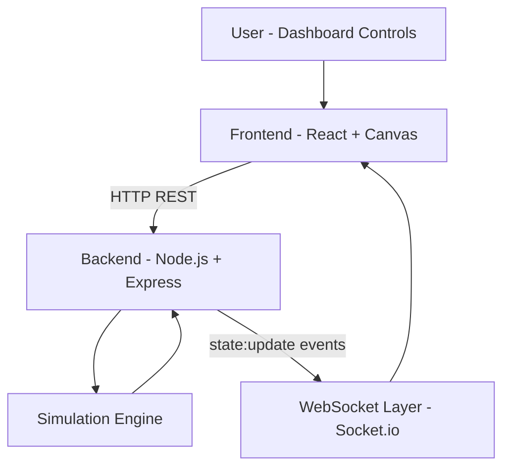

# Fleet Management System with Real-Time Simulation

## 1. Project Overview

The **Fleet Management System with Real-Time Simulation** is a full-stack web application that simulates multiple robots operating on a 2D grid map. It demonstrates how modern industrial fleet systems coordinate autonomous agents to execute transport tasks in real time.

The application allows users to create pickup/drop tasks, automatically assigns the best available robot, plans movement paths, and continuously visualizes robot motion on a live dashboard. The goal is to present core fleet-management concepts in a simple, beginner-friendly, and professional way.

---

## 2. Problem Statement

In warehouses, factories, and logistics hubs, multiple robots often share the same workspace. Without a fleet management strategy, robot operations can become inefficient and unsafe.

Key challenges include:

- **Task allocation:** deciding which robot should execute a new task.
- **Multi-agent coordination:** managing many robots at the same time.
- **Collision avoidance:** preventing robots from entering the same cell/location.
- **Efficient resource utilization:** reducing idle time and improving throughput.

This project addresses these core challenges through a simulation-oriented architecture.

---

## 3. Objectives

The main objectives of this system are:

- Build a **real-time multi-robot simulation** on a 2D grid.
- Implement **automatic task assignment** to the nearest idle robot.
- Implement **path planning** using a simple and reliable algorithm.
- Ensure **collision-aware movement** using waiting/resume logic.
- Provide a **live visual dashboard** with API and WebSocket integration.
- Offer a clear technical base suitable for academic demonstration and viva.

---

## 4. System Architecture

### 4.1 Architecture Diagram 



### 4.2 Architecture Explanation

- **Frontend (React + Canvas):**
  - Renders the grid and robot positions.
  - Sends task creation requests to backend APIs.
  - Receives real-time simulation state via WebSocket.

- **Backend (Node.js + Express):**
  - Exposes REST APIs (`/robots`, `/task`, `/state`).
  - Validates task payloads and manages system state access.

- **Simulation Engine:**
  - Maintains robots, task queue, and movement logic.
  - Executes a discrete loop every 500 ms.
  - Handles assignment, pathing, and collision checks.

- **WebSocket Communication (Socket.io):**
  - Broadcasts updated simulation state continuously.
  - Keeps dashboard synchronized with backend in real time.

---

## 5. System Workflow

1. User enters task start and end coordinates in the dashboard.
2. Frontend sends a `POST /task` request to backend.
3. Backend selects the **nearest idle robot**.
4. Simulation engine computes a grid path using BFS.
5. At every 500 ms tick, robot moves one step (if allowed).
6. If next cell is occupied, robot waits and retries next tick.
7. Backend emits updated state through Socket.io.
8. Frontend receives new state and updates the canvas view smoothly.

---

## 6. AI / Algorithm Concepts Used

This project uses foundational algorithmic concepts commonly discussed in AI and robotics.

### 6.1 Greedy Algorithm (Nearest Robot Selection)

- For each new task, the backend checks all idle robots.
- It selects the robot with the minimum Manhattan distance to task start.
- Called "greedy" because it makes the best immediate local choice.

### 6.2 Graph Traversal - Breadth-First Search (BFS)

- The grid is treated as a graph where each cell is a node.
- BFS explores neighbors level-by-level and finds a valid shortest grid path (in steps).
- Used for path generation from robot -> start and start -> end.

### 6.3 Multi-Agent Systems

- Multiple robots act as independent agents.
- Each agent has its own state (position, status, task, path).
- Shared environment rules coordinate their movement safely.

### 6.4 Discrete Simulation

- The simulator does not run in continuous physics mode.
- It updates state at fixed time intervals (`500 ms`).
- This step-based model is easy to understand, debug, and present in viva.

### 6.5 Collision Avoidance Logic

- Before moving, each robot checks whether its next cell is already occupied.
- If occupied, robot waits (logical lock on that cell remains with current occupant).
- Movement resumes automatically when the path becomes clear.

---

## 7. Data Structures Used

- **Grid (2D logical space):**
  - Coordinate-based environment (`x`, `y`) with bounds checking.

- **Queue (BFS exploration queue):**
  - Stores cells to visit in first-in-first-out order.

- **Set / Map:**
  - Track visited nodes and parent relationships in BFS.
  - Track occupied cells for collision checking.

- **Objects (Robots and Tasks):**
  - Robot object: `id`, `x`, `y`, `status`, `path`, `task`.
  - Task object: `id`, `start`, `end`, `createdAt`.

- **Array (Task queue and robot collection):**
  - Stores pending tasks and active robots.

---

## 8. Simulation Logic

The simulation engine runs a loop every **500 ms**:

- Assign queued tasks when idle robots are available.
- For each robot:
  - Check next path step.
  - If next cell is occupied, wait.
  - Otherwise move one cell.
- Update robot status (`idle` / `moving`).
- Emit latest global state to clients via WebSocket.

This produces deterministic, explainable robot movement suitable for learning and demonstrations.

---

## 9. API Documentation

Base URL (default backend): `http://localhost:4000`

### 9.1 Get Robots

- **Endpoint:** `/robots`
- **Method:** `GET`
- **Request Body:** None
- **Purpose:** Returns compact robot list and status.

**Example Response**

```json
[
  {
    "id": "R1",
    "x": 3,
    "y": 7,
    "status": "moving",
    "taskId": "T2"
  },
  {
    "id": "R2",
    "x": 11,
    "y": 5,
    "status": "idle",
    "taskId": null
  }
]
```

### 9.2 Get Full Simulation State

- **Endpoint:** `/state`
- **Method:** `GET`
- **Request Body:** None
- **Purpose:** Returns grid, robots, queue, and tick metadata.

**Example Response**

```json
{
  "grid": { "width": 20, "height": 20 },
  "tickMs": 500,
  "robots": [
    { "id": "R1", "x": 3, "y": 7, "status": "moving", "taskId": "T2" }
  ],
  "queuedTasks": [
    {
      "id": "T3",
      "start": { "x": 1, "y": 1 },
      "end": { "x": 10, "y": 12 },
      "createdAt": 1760000000000
    }
  ]
}
```

### 9.3 Create Task

- **Endpoint:** `/task`
- **Method:** `POST`
- **Request Body:** Task start and end coordinates
- **Purpose:** Adds task and attempts immediate assignment.

**Request Body**

```json
{
  "start": { "x": 1, "y": 1 },
  "end": { "x": 8, "y": 5 }
}
```

**Success Response (`201 Created`)**

```json
{
  "id": "T4",
  "start": { "x": 1, "y": 1 },
  "end": { "x": 8, "y": 5 },
  "createdAt": 1760000001234
}
```

**Error Response (`400 Bad Request`)**

```json
{
  "error": "Invalid task payload. Use { start: {x,y}, end: {x,y} }."
}
```

---

## 10. Frontend Explanation

The frontend is implemented in React and uses an HTML Canvas for efficient real-time drawing.

- **Canvas Rendering:**
  - Draws the full grid and robot markers each animation frame.
  - Uses interpolation for smooth visual motion between simulation ticks.

- **Robot Visualization:**
  - Robots are shown as colored circles with ID labels.
  - Status and coordinates are listed in the dashboard panel.

- **Real-Time Communication:**
  - Initial state fetched via REST (`GET /state`).
  - Continuous updates received through Socket.io `state:update` events.

- **Task Input UI:**
  - Form allows users to define start and end cells.
  - Submits task to backend and updates queue/status automatically.

---

## 11. Features (Enhanced)

- Real-time multi-robot fleet simulation on a 20x20 grid.
- Automatic nearest-robot assignment for incoming tasks.
- BFS-based path computation for predictable route generation.
- Collision-aware, step-by-step robot movement with wait-and-resume behavior.
- Live web dashboard with synchronized REST + WebSocket communication.
- Clean modular structure for easy extension and academic evaluation.

---

## 12. Sample Use Cases

### 12.1 Single Task Execution

- User submits one task.
- Nearest idle robot receives assignment and completes route.
- Dashboard shows movement and final idle state.

### 12.2 Multiple Task Execution

- User submits multiple tasks quickly.
- Available robots are assigned first.
- Remaining tasks stay queued until robots become idle.

### 12.3 Queue Behavior Under Load

- When all robots are busy, new tasks are stored in queue.
- On each tick, simulator checks for newly idle robots.
- Queued tasks are assigned in order with nearest-idle selection at assignment time.

---

## 13. Limitations

- No static or dynamic obstacles in the map.
- Collision handling is basic (wait logic, no advanced negotiation).
- No persistent storage/database; state resets on server restart.
- No priority scheduling, deadline handling, or battery constraints.
- Single-process simulation (not distributed fleet coordination).

---

## 14. Future Enhancements

- Add obstacle maps and dynamic obstacle avoidance.
- Use advanced optimization (A*, Hungarian assignment, reinforcement learning policies).
- Add task priority, robot capacity, and energy-aware scheduling.
- Integrate persistent database for logs, analytics, and replay.
- Connect with physical robots (ROS bridge / hardware communication layer).
- Extend dashboard with 3D visualization and performance metrics.

---

## 15. Tech Stack

- **Backend:** Node.js, Express, Socket.io
- **Frontend:** React, Vite, HTML Canvas, Socket.io Client
- **Language:** JavaScript
- **Runtime:** Node.js (Windows compatible)

---

## 16. Project Structure

```text
backend/
  server.js
  simulation.js
  routes/
    index.js
frontend/
  src/
    App.jsx
    GridCanvas.jsx
    api.js
    main.jsx
    style.css
README.md
```

---

## 17. Installation and Setup (Windows PowerShell)

### 17.1 Prerequisites

- Node.js (v18+ recommended)
- npm (comes with Node.js)

### 17.2 Install Dependencies

```powershell
cd D:\Downloads\Fleet\backend
npm install
```

```powershell
cd D:\Downloads\Fleet\frontend
npm install
```

### 17.3 Run Application

Open two terminals.

**Terminal 1 (Backend)**

```powershell
cd D:\Downloads\Fleet\backend
npm run start
```

**Terminal 2 (Frontend)**

```powershell
cd D:\Downloads\Fleet\frontend
npm run dev
```

Open the URL shown in terminal (usually `http://localhost:5173`).

---

## 18. Conclusion

This project demonstrates the essential building blocks of a fleet management platform in a simplified but meaningful way. It combines task allocation, path planning, collision-aware movement, and real-time visualization into a complete full-stack system. The implementation is practical for learning, clear enough for viva explanation, and extensible for advanced research or industrial-inspired improvements.
